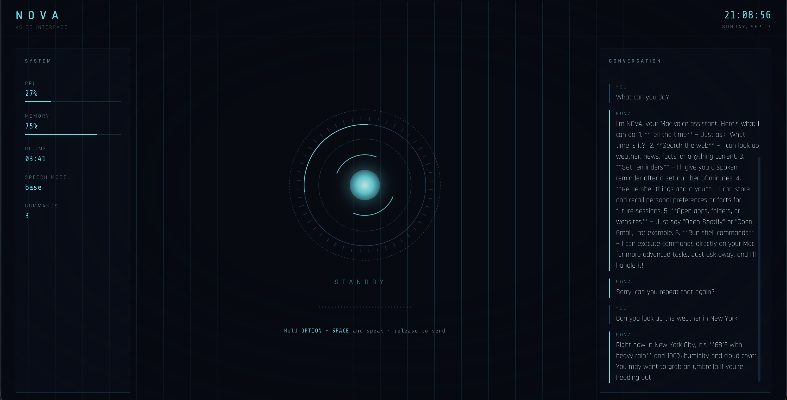
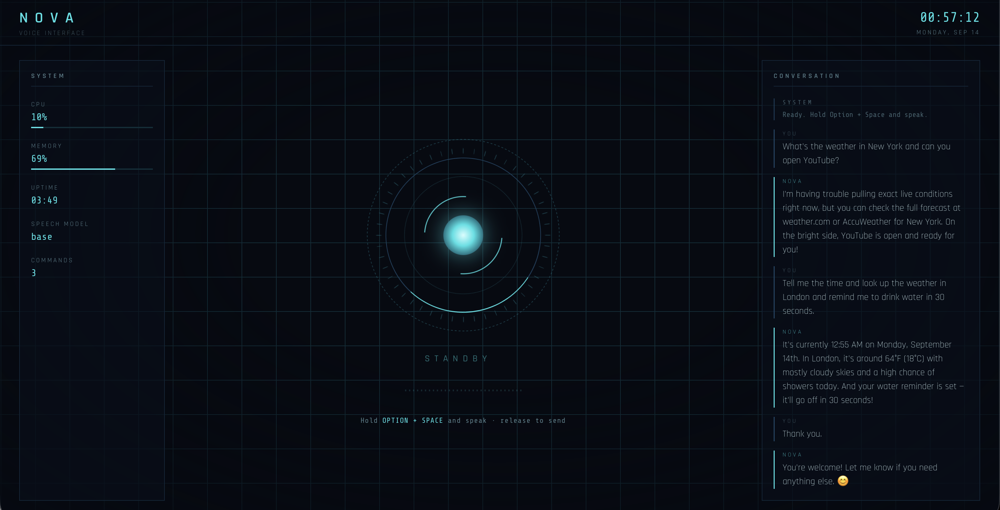

# NOVA


> **several commands in a single request** — powered by the Claude API, with a live reactor-core HUD.


---

## Overview

Most voice assistants handle one instruction at a time: *"Set a timer."* Then you wait, then you ask the next thing. **NOVA is different.** You can chain several requests into one natural sentence —

> *"What's the weather in New York, remind me to call mom in 20 minutes, and open Spotify."*

— and NOVA understands all three, runs them in order, and reports back out loud. That's the core idea that sets it apart from a typical single-command assistant.

Press **Option + Space**, speak, and release. NOVA transcribes your audio, reasons about everything you asked using the Claude API, executes each task (its "skills"), and speaks the results back in a natural macOS voice.

It's built around four ideas:

- **Multi-command understanding** — say several things at once; NOVA figures out each task and handles them in sequence.
- **Local-first** — audio, transcription, and text-to-speech all happen on your Mac. Only the text of your command is sent to Claude's API.
- **Tiered permissions** — NOVA acts on its own for safe operations, but always asks before doing anything sensitive (see [Permissions](#permissions)).
- **Extensible skills** — new abilities are added as small, self-contained Python functions.

The interface is a lightweight HUD served from a local web page — not a native app window — with a Jarvis/Iron Man aesthetic: a reactor core that shifts color with NOVA's state (idle, listening, thinking, responding), a live system vitals panel, and a running conversation log.

---

## Screenshots

<p align="center">
  
</p>

<p align="center"><i>The reactor-core HUD in standby — live CPU/memory vitals on the left, a running conversation log on the right.</i></p>

<p align="center">
  
</p>

<p align="center"><i>NOVA in action with multi-command handling and real-time response.</i></p>

---

## Table of Contents

- [What Makes NOVA Different](#what-makes-nova-different)
- [Features](#features)
- [Screenshots](#screenshots)
- [How It Works](#how-it-works)
- [Installation](#installation)
- [Usage](#usage)
- [Configuration](#configuration)
- [Permissions](#permissions)
- [Adding a Skill](#adding-a-skill)
- [Project Structure](#project-structure)
- [Troubleshooting](#troubleshooting)
- [Roadmap](#roadmap)
- [License](#license)

---

## What Makes NOVA Different

| | Typical voice assistant | **NOVA** |
|---|---|---|
| **Commands per request** | One at a time | **Multiple in a single sentence** |
| **Reasoning** | Fixed intent matching | LLM reasoning via Claude |
| **Where it runs** | The cloud | **Locally on your Mac** |
| **Extending it** | Closed | Open, add your own skills |
| **Interface** | Voice only | Voice **+** live reactor-core HUD |

The headline feature is that first row: NOVA breaks a multi-part spoken request into individual tasks and completes each one, instead of forcing you to speak them one by one.

---

## Features

- 🗣️ **Multi-command handling** — chain several requests into one sentence
- 🎙️ **Push-to-talk voice control(MacOS)** — hold **Option + Space**, speak, release
- 🧠 **LLM-orchestrated reasoning** — Claude decides intent and routes to the right skills
- 🔊 **Native macOS text-to-speech** — speaks with the built-in `Daniel` voice by default
- 💠 **Animated reactor-core HUD** — cyan (standby) → bright (listening) → amber (thinking) → ripple (responding)
- 📊 **Live system vitals panel** — CPU, RAM, uptime, and command count
- 🗂️ **Persistent memory** — remembers facts across sessions
- 🧩 **Pluggable skill system** — add new abilities without touching core logic
- 🔐 **Tiered permission model** — auto-run, confirm-once, and confirm-always actions
- 🖥️ **Two run modes** — full HUD in a browser tab, or terminal-only

---

## How It Works

```
  🎙️ Hold Option+Space          🧠 Claude API                🔊 macOS `say`
  ──────────────────    ┌──────────────────────┐    ──────────────────────
  Speak your command(s) ─▶│  stt.py → brain.py    │─▶│  Results spoken aloud  │
                          │  (transcribe → split   │    └──────────────────────┘
                          │   into tasks → reason  │
                          │   → run each skill →    │
                          │   reply)                │
                          └──────────┬─────────────┘
                                     │
                           ┌─────────▼─────────┐
                           │   skills/ package   │
                           │  (weather, search,   │
                           │   reminders, apps…)  │
                           └─────────────────────┘
```

1. You hold **Option + Space** and speak; `recorder.py` captures the audio.
2. `stt.py` transcribes it to text.
3. `brain.py` sends the transcript to Claude, which **identifies every task in the request** and decides which skill each one needs.
4. Before running any sensitive skill, `permissions.py` checks its tier.
5. Each task runs in order; `tts.py` speaks the combined result using macOS's built-in voice.
6. The HUD (`ui/index.html`) reflects each stage in real time.

---

## Installation

**Requirements:** macOS, Python 3.10+, an Anthropic API key.

```bash
git clone https://github.com/<your-username>/nova.git
cd nova
pip install -r requirements.txt
export ANTHROPIC_API_KEY="sk-ant-..."
```

>  Add the `export` line to your `~/.zshrc` so you don't need to set it every session.

---

## Usage

**With the HUD (recommended):**

```bash
python app.py
```

This starts a local server and opens NOVA in your default browser at `http://127.0.0.1:8765`. It isn't a website — it's a small server running only on your machine. Nothing leaves your computer except the text sent to Claude's API.

> A browser tab is used instead of a native window because native window libraries (e.g. under Anaconda/conda Python) can crash unpredictably on some Mac setups. The browser tab is more reliable and looks and behaves identically.

**Terminal-only, no browser:**

```bash
python main.py
```

**Try a multi-command request:**

> *"Tell me the time, look up the weather in London, and remind me to stretch in 15 minutes."*

---

## Configuration

All user-facing settings live in `config.py`.

### Voice

NOVA speaks with **Daniel**, the built-in British macOS voice, by default.

Preview every voice available on your Mac:

```bash
python tts.py
```

Then set your favorite in `config.py`:

```python
TTS_VOICE = "Daniel"   # alternatives: Oliver, Arthur, Serena, Kate
```

For a higher-quality voice later, swap in **Piper** or **ElevenLabs** — only `tts.py` needs to change.

### Hotkey

```python
PTT_KEY = "option_space"   # default: hold Option + Space
# "option"  → hold Option alone
# "f13"     → a single dedicated key
```

---

## Permissions

NOVA's actions are grouped into three trust tiers, enforced by `permissions.py`:

| Tier | Behavior | Examples |
|------|----------|----------|
| **1** | Runs automatically | Time, web search, reminders, memory recall |
| **2** | Asks once per session | Opening apps and folders |
| **3** | Asks every time | Shell commands |

---

## Adding a Skill

1. Write a function that implements the skill's behavior.
2. Register it in `skills/__init__.py` with a name, description, and permission tier.
3. Claude picks it up automatically the next time NOVA starts — no other wiring required.

---

## Project Structure

```
nova/
├── app.py            # Entry point — HUD + hotkey listener
├── main.py            # Entry point — terminal-only mode
├── brain.py           # Claude API integration + multi-task tool loop
├── config.py           # All user-editable settings
├── stt.py              # Speech-to-text
├── tts.py              # Text-to-speech
├── recorder.py          # Push-to-talk audio capture
├── permissions.py        # Three-tier permission system
├── memory.py            # Cross-session persistent memory
├── skills/              # Individual skill implementations
├── ui/
│   └── index.html        # Reactor-core HUD
├── screenshots/          # Images used in this README
├── requirements.txt
├── LICENSE
└── README.md
```

---

## Troubleshooting

| Problem | Fix |
|---|---|
| **No voice output** | Run `python tts.py`. If nothing plays, it's your Mac's audio output/volume, not NOVA. |
| **NOVA never hears you** | System Settings → Privacy & Security → Microphone → allow Terminal, then fully quit and reopen Terminal. |
| **Option + Space does nothing** | System Settings → Privacy & Security → Accessibility → allow Terminal. macOS blocks global hotkeys without this. Quit and reopen Terminal after granting it. |
| **Browser tab doesn't open** | Go to `http://127.0.0.1:8765` manually in any browser. |
| **"Address already in use"** | An old NOVA instance is still running. Close that Terminal window, or run `killall python`. |

---

## Roadmap

- [ ] Stabilize `app.py` (pywebview) across all Mac setups
- [ ] Higher-quality TTS via Piper or ElevenLabs
- [ ] Expanded skill library
- [ ] Smarter handling of dependent multi-step commands (*"find a recipe and then set a timer for it"*)
- [ ] Packaged `.app` distribution

---

## License

Released under the [MIT License](LICENSE).

---

<p align="center"><i>Built as a personal exploration of local-first, multi-command, LLM-orchestrated voice assistants.</i></p>
